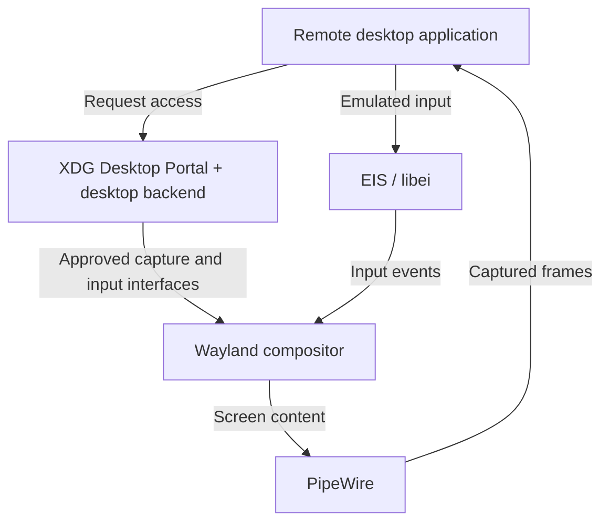
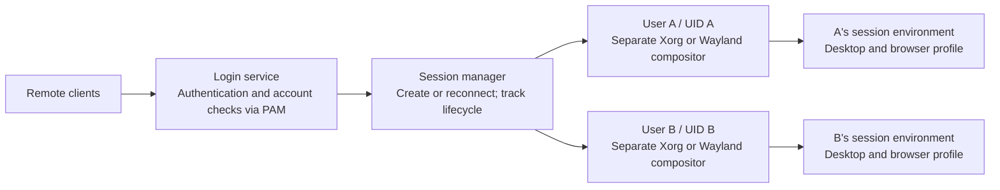
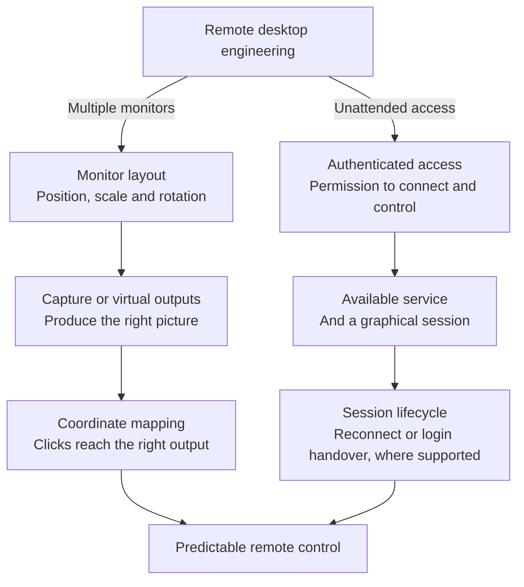
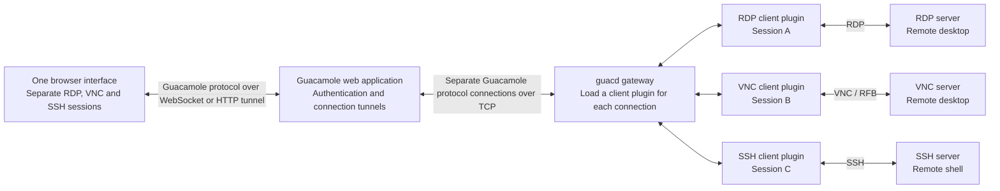
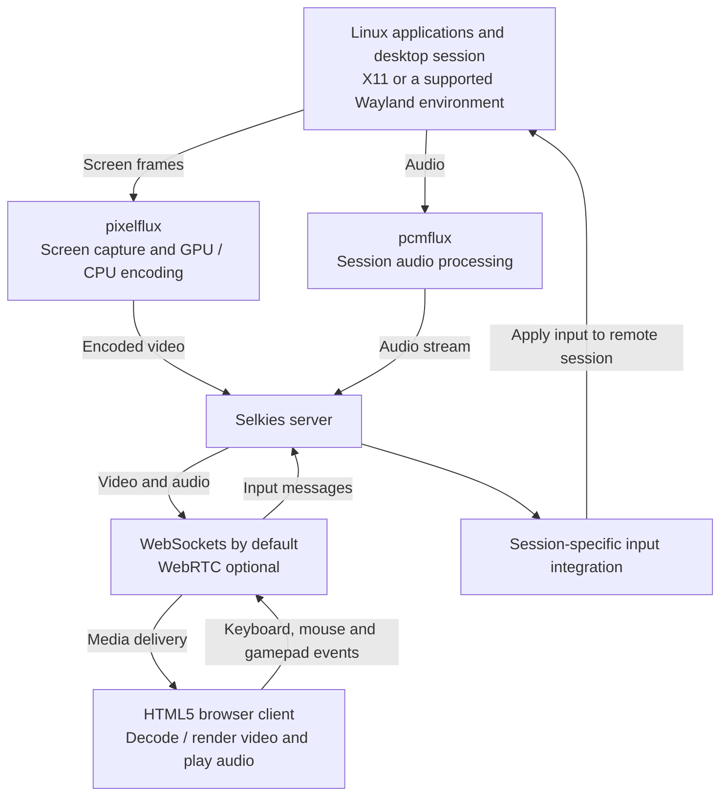

I started looking into this while working on [Termland](https://github.com/jboero/termland), a remote desktop project that creates headless Wayland sessions. What seemed like a question about connecting a client to a server turned into a much larger question: who actually owns the desktop that I am trying to access?

On Linux, the answer affects almost everything. Can I connect before logging in? Will the connection survive a locked screen? Can I create a separate desktop without a monitor? Why does a tool work on GNOME but behave differently on KDE, even when both use Wayland?

The transition from X11 to Wayland caused real regressions in established remote workflows. But describing the situation as “Wayland cannot do remote desktop” misses what has changed. Remote access now depends on the compositor, permission interfaces, and session infrastructure as well as the network protocol.

This article reflects documentation and project code reviewed in September 2026. It is an architectural overview, not a performance benchmark, and development announcements are identified separately from released capabilities.

## Table of contents

## What do we mean by remote desktop?

Before comparing protocols, we need to separate the workflows people expect.

| Workflow                   | What you are connecting to                                         |
| -------------------------- | ------------------------------------------------------------------ |
| Application forwarding     | A remotely running application whose windows appear locally        |
| Desktop sharing            | An existing desktop visible to both the local and remote user      |
| Remote login               | A login service that can create a graphical session                |
| Persistent virtual desktop | An independent desktop that can survive disconnects and be resumed |

A screen-sharing tool might be excellent for helping someone at their computer and still be unsuitable for a workstation that must be accessible after reboot. A virtual desktop can be useful without showing the applications already open on the physical display.

These differences are not academic. [GNOME's configuration documentation](https://github.com/GNOME/gnome-remote-desktop/blob/main/docs/configuration.md) explicitly separates remote assistance, single-user headless operation, and headless remote login. Any claim that a product “supports remote desktop” should say which workflow it supports.

## X11 made remote display part of the architecture

The X Window System uses a client-server model. The application is an X client; the X server provides the display and input services. The server can be on the computer in front of you while the application runs somewhere else. The [X11 protocol specification](https://xorg.freedesktop.org/archive/current/doc/xproto/x11protocol.pdf) defines that communication.

This is the foundation behind SSH X forwarding. The remote application connects to a proxy display, and SSH carries its X11 traffic to your local X server. It does not simply stream a video of the remote machine's entire desktop.

Other remote tools built different experiences around X. [Xpra](https://github.com/Xpra-org/xpra/blob/master/README.md), for example, provides persistent remote X11 applications that can be disconnected and reattached. [xrdp](https://github.com/neutrinolabs/xrdp) speaks RDP to the remote client while commonly providing the Linux desktop through Xorg with xorgxrdp, or through Xvnc.

So even in the X11 world, application forwarding, virtual desktops, and screen sharing were separate approaches. What they benefited from was a broadly available display-server integration point.

Input automation also had an established interface: the [XTEST extension](https://www.x.org/releases/X11R7.5/doc/man/man3/XTestFakeKeyEvent.3.html) can synthesize keyboard and pointer events. This helped tools interact with desktops without integrating separately with every window manager.

That convenience came with security considerations. X11 does have mechanisms for restricting untrusted clients, including the [SECURITY extension](https://www.x.org/releases/X11R7.7-RC1/doc/xextproto/security.pdf). It would be inaccurate to say it has no security model. The relevant question is how much authority a connected application receives over the rest of the desktop.

## Wayland changes the integration point

Under Wayland, the compositor is also the display server. It assembles application surfaces, manages their placement, determines focus, and routes input. Applications render their content and submit buffers for presentation. [Wayland's architecture documentation](https://wayland.freedesktop.org/architecture.html) describes this consolidation.

Mutter in GNOME, KWin in Plasma, and compositors built with wlroots are therefore central to remote access. A remote desktop server needs a way to obtain their output and send authorized input back into their sessions.

Wayland does not include X11-style network transparency in its core protocol. That does not prohibit remoting. The [upstream FAQ](https://wayland.freedesktop.org/faq.html) explicitly discusses additional remote rendering infrastructure.

This shift explains why old assumptions stop working. An application that knew how to capture an X display cannot assume the same approach will capture a complete native Wayland desktop.

[Xwayland](https://wayland.freedesktop.org/docs/book/Xwayland.html) preserves compatibility for X11 applications within a Wayland session. It does not turn the whole desktop back into an X server accessible to every legacy capture tool.

## Getting pixels is only one part of the problem

A functioning remote desktop needs capture, input, clipboard integration, authentication, and a defined session lifecycle. It also needs to handle monitor layouts, scaling, cursor behavior, and keyboard differences.

The shared infrastructure increasingly looks like this:

This is one important integration path, not a requirement that every server must use exactly this arrangement.

The [ScreenCast portal](https://flatpak.github.io/xdg-desktop-portal/docs/doc-org.freedesktop.portal.ScreenCast.html) exposes selected screen content through PipeWire. The [RemoteDesktop portal](https://flatpak.github.io/xdg-desktop-portal/docs/doc-org.freedesktop.portal.RemoteDesktop.html) handles access to input devices and related capabilities. [libei](https://libinput.pages.freedesktop.org/libei/api/index.html) supplies an emulated-input interface while leaving the compositor in control of processing events.

An important consequence is that screen sharing and remote control are separate capabilities. The [xdg-desktop-portal-wlr registration](https://raw.githubusercontent.com/emersion/xdg-desktop-portal-wlr/master/wlr.portal) advertises Screenshot and ScreenCast, but not RemoteDesktop. Being able to share a screen in a browser therefore does not prove that a remote control application can inject input through the same backend.

Permission persistence is another source of confusion. Remembering a portal grant can reduce repeated approval prompts. It does not by itself create a graphical session after reboot or preserve applications after logout.

## Why remote login is harder than screen sharing

If someone is already logged in, a compositor and graphical session already exist. A remote login service must arrange for them to exist and connect the incoming user to the correct session.

[SUSE's engineering account](https://www.suse.com/c/headless-remote-sessions-in-gnome-part-2/) describes GNOME's approach: a system daemon receives the connection, GDM creates a headless login session, and a session daemon takes over the connection. After authentication, the user session has another compositor and requires another handover. [The follow-up](https://www.suse.com/c/headless-remote-sessions-in-gnome-part-3/) explains that transition.

This is why adding a video encoder is not enough. The implementation must coordinate the display manager, credentials, session ownership, and connection transitions. RDP's server-redirection mechanism is useful here because the connection needs to move between components.

Unattended access and multi-user access also deserve separate labels. Connecting without local approval does not necessarily mean a service can provide independent desktops to several users concurrently.

## Two users, two desktops—or two connections to one desktop?

This is where my original question became a session-management question. Two people logging into separate accounts, one person opening two independent desktops, and two clients watching the same desktop are three different requirements. A server supporting one does not automatically support the others. Sharing a desktop also shares the applications and input focus; it is not isolation between users.

XRDP makes the layers easier to see. Its [Xorg backend](https://github.com/neutrinolabs/xorgxrdp) installs modules into Xorg; the client still speaks RDP. The [session-management architecture](https://github.com/neutrinolabs/xrdp/wiki/SessionManagementArchitecture), documented for versions after 0.9.x, separates `xrdp-sesman`, which tracks sessions and handles requests, from `xrdp-sesexec`, which handles authentication, the PAM session, and that session's top-level processes. For a new desktop, it starts the X server, checks it, then starts the window manager and channel service under the user's UID. Reconnection can attach to an existing session instead. Desktop exit triggers process cleanup and PAM-session teardown.

So the tight coupling is between **that backend and Xorg**, not between RDP and X11. A Wayland implementation can speak the same network protocol while doing session creation differently.

PAM is part of this lifecycle, not a desktop allocator. Authentication and account checks establish who may log in; opening a PAM session runs the configured setup hooks. For example, [pam_systemd](https://www.man7.org/linux/man-pages/man8/pam_systemd.8.html) registers sessions with logind. Something else still has to choose a display, start the desktop, route the connection, and decide what survives a disconnect.

Here is the separation I would expect from an independent-user service. This is a conceptual model, not an exact process diagram for every implementation:

### When the second browser does not open

I would not start by blaming a `DISPLAY` TCP-port collision. [`DISPLAY`](https://man.archlinux.org/man/X.7.en) identifies the X server an application connects to; it does not tell each application to open its own listening port. Local X connections commonly use Unix sockets. XRDP's [upstream configuration template](https://github.com/neutrinolabs/xrdp/blob/devel/sesman/sesman.ini.in) even starts its Xorg backend with `-nolisten tcp`. Two applications using one display is normal; two X servers trying to claim the same display is a different problem.

Another possibility is the browser profile. [Chromium's documentation](https://chromium.googlesource.com/chromium/src/+/HEAD/docs/user_data_dir.md) explains that concurrent instances cannot share a user-data directory and that one instance cannot spread its windows across multiple X displays. With two desktops under the same account, a launch can reach an existing instance or fail to create the expected independent one. A separate `--user-data-dir` addresses that browser conflict, not every desktop-service conflict.

The surrounding environment matters too: wrong display authorization, stale `DISPLAY` or `WAYLAND_DISPLAY`, or services reached through the wrong session environment can all misdirect an application. Separate graphical sessions do not imply separate copies of everything owned by the user. In particular, pam_systemd documents a shared `XDG_RUNTIME_DIR` and user service manager for simultaneous logins under the same UID. Arbitrarily changing that directory is not a general isolation fix.

My engineering takeaway is to make ownership explicit. Use distinct accounts for distinct users; pass each application the correct session environment; give independent browser instances separate profiles; and define session limits, reconnection, logout, and cleanup policies. Containers or VMs can strengthen separation, but still need correctly configured identities, storage, display sockets, and device access. Opening another network port is not a substitute for this work.

### What Windows RDP adds around the protocol

[Windows Remote Desktop Services](https://learn.microsoft.com/en-us/windows-server/remote/remote-desktop-services/overview) demonstrates the same distinction. RD Session Host runs multiple users' desktops and applications; RD Connection Broker tracks sessions, supports reconnection, and distributes connections across hosts. These are infrastructure roles around RDP, not capabilities created by a browser viewer.

Windows also has explicit GUI-session boundaries: each interactive Remote Desktop Services session has its own [interactive window station](https://learn.microsoft.com/en-us/windows/win32/winstation/window-stations), containing desktop and clipboard-related objects. That does not remove the need for capacity and profile planning. Nor should ordinary Windows desktop RDP be confused with RDS Session Host or the separate [Windows Enterprise multi-session offering](https://learn.microsoft.com/en-us/azure/virtual-desktop/windows-multisession-faq).

If the GUI fails, SSH is useful for inspecting processes, logs, and session state. It is not mandatory for a functioning remote desktop, and a shell does not repair missing compositor or login-service integration. SSH can also transport a working service through a tunnel; transport and desktop creation remain separate jobs.

## Why the experience differs across distributions

It is tempting to ask why every distribution needs its own remote desktop application. Often, the actual difference starts with the desktop environment.

[GNOME Remote Desktop](https://github.com/GNOME/gnome-remote-desktop/blob/main/README.md) integrates with Mutter. KDE provides [KRDP](https://github.com/KDE/krdp), with remote desktop configuration introduced in [Plasma 6.1](https://kde.org/announcements/plasma/6/6.1.0/). These are upstream desktop projects, rather than separate protocols invented by each distribution.

But their session stories are not interchangeable. [GNOME's configuration guide](https://github.com/GNOME/gnome-remote-desktop/blob/main/docs/configuration.md) documents RDP-based headless multi-user remote login through GDM, separately from remote assistance and single-user headless operation. The display manager and per-session services supply the coordination that a screen-sharing interface alone cannot.

For KDE, the [August 25, 2026 developer report](https://blog.davidedmundson.co.uk/blog/whats-happening-in-kde-remote-desktop-improved-unattended-mode-and-more/) describes work toward Plasma 6.8: private unattended access, client-sized outputs, and better input integration. It explicitly says concurrent multi-user headless hosting is unlikely for that release. These are development plans, not a claim that every installed Plasma already provides them. Headless, unattended, and multi-user still need separate checkboxes.

[WayVNC](https://github.com/any1/wayvnc) attaches to an already running compatible wlroots-based compositor, which can itself be headless. Its optional PAM authentication does not make it a display manager. Hosting independent users requires orchestration to launch their compositor instances and route clients to them; WayVNC does not support Mutter or KWin simply because they also speak Wayland.

COSMIC takes another path through its Smithay-based compositor. Its [Epoch 1.7.0 release notes](https://github.com/pop-os/cosmic-epoch/releases/tag/epoch-1.7.0) record RemoteDesktop portal support for capabilities such as keyboard and mouse control. That is useful progress, but not evidence of a complete RDP login service or concurrent-user desktop broker. A portal grants interfaces into a session; it does not provision independent desktops.

What encourages me is seeing this work happen in public. In [the RemoteDesktop portal PR](https://github.com/pop-os/xdg-desktop-portal-cosmic/pull/317), Hojjat Abdollahi shared implementations and demos while contributors discussed permission wording, screen selection, and keyboard accessibility. The screenshots make that engineering tangible: not just getting input events through, but helping people understand what they are allowing. The PR merged on August 19, 2026; these are snapshots from its development, not my own tests or a demonstration of multi-user remote login.

Community in action: COSMIC portal screenshots and a keyboard-navigation demo

<figure>
  
  <figcaption>
    An early permission-dialog design makes the requested input devices and permission lifetime visible. Screenshot by Hojjat Abdollahi, from the <a href="https://github.com/pop-os/xdg-desktop-portal-cosmic/pull/317">PR description</a>.
  </figcaption>
</figure>

<figure>
  
  <figcaption>
    A later iteration clarifies that more than one screen can be selected. Screenshot by Hojjat Abdollahi, shared in the <a href="https://github.com/pop-os/xdg-desktop-portal-cosmic/pull/317#issuecomment-5312161906">design-review discussion</a>.
  </figcaption>
</figure>

<figure>
  <video
    controls
    playsinline
    preload="none"
    aria-label="COSMIC portal development demo showing keyboard navigation of the screen selector"
    style="width: 100%; height: auto;"
  >
    <source src="https://github.com/user-attachments/assets/f1411047-76f9-4cbe-ae81-0a3d4df3c169" type="video/mp4" />
    Your browser does not support embedded video. <a href="https://github.com/pop-os/xdg-desktop-portal-cosmic/pull/317#issuecomment-5331660661">Watch the demo in the original PR comment</a>.
  </video>
  <figcaption>
    Keyboard navigation: Tab moves between outputs and Space selects them, as described by Hojjat Abdollahi in the <a href="https://github.com/pop-os/xdg-desktop-portal-cosmic/pull/317#issuecomment-5331660661">original demo comment</a>. This is a UI demonstration, with no spoken narration or remote-session benchmark.
  </figcaption>
</figure>

Distributions then ship particular versions, dependencies, services, and defaults. My reading of the evidence is that these combinations explain much of what users perceive as distribution-specific behavior. Both [RHEL 10](https://docs.redhat.com/en/documentation/red_hat_enterprise_linux/10/html/administering_rhel_by_using_the_gnome_desktop_environment/remotely-accessing-the-desktop) and [SLES 16](https://documentation.suse.com/sles/16.0/html/SLES-gnome-remote-desktop/index.html) document GNOME-based remote access.

Raspberry Pi Connect is a useful example of a product built around existing pieces. Its [launch announcement](https://www.raspberrypi.com/news/raspberry-pi-connect/) describes connecting a browser client to a VNC server using WebRTC. It adds the discovery and connection experience users need.

Its [documentation](https://www.raspberrypi.com/documentation/services/connect.html) also makes the integration boundary explicit: screen sharing requires an existing graphical session and a desktop supported by its WayVNC integration. Switching to KDE/KWin changes compatibility, even on the same device and distribution.

## Why keep moving toward Wayland, then?

The remote-desktop friction is real, but it is not the whole architectural tradeoff. [Wayland's motivation](https://wayland.freedesktop.org/docs/book/Introduction.html) describes moving beyond an X stack that accumulated rendering and display responsibilities now handled elsewhere. Making the compositor the display server gives it direct control of presentation and input routing. Output scaling and frame scheduling can be designed around that ownership, rather than bolted onto an older path.

For remote access, that control cuts both ways. An application does not receive blanket authority to capture other windows or inject input just by connecting as a native Wayland client; authorized interfaces must provide those capabilities. This creates a more explicit boundary, but also explains why older remote tools need integration work. Neither the protocol nor that boundary guarantees lower latency, working NVIDIA support, or complete remote login on every desktop.

### COSMIC, NVIDIA, and which GPU does what

“The session is not targeting NVIDIA” needs more context than I initially expected. [System76 documents COSMIC as designed for hybrid graphics](https://support.system76.com/support/graphics-switch-pop/): applications can request the dedicated GPU, and users can select it through the launcher. Keeping lighter work on integrated graphics can be intentional, rather than proof of failed acceleration.

There are four separate questions: which GPU renders the application, which renders the compositor, which drives a physical monitor, and which encodes the remote video? Those roles need not use the same device. Selecting NVIDIA for a browser does not establish that the remote server uses NVIDIA encoding, and a headless desktop need not drive a physical monitor at all.

Real selection bugs exist too. [COSMIC Epoch 1.8.0](https://github.com/pop-os/cosmic-epoch/releases/tag/epoch-1.8.0) includes a fix that checks all connectors when selecting the primary GPU, addressing some hybrid-laptop problems. I would record GPU models, driver and compositor versions, connected outputs, and the affected workload before interpreting a particular failure. That makes COSMIC a useful example of implementation work still needed—not a universal verdict against Wayland or a promise that forcing the dedicated GPU solves remoting.

### The engineering behind multiple monitors and unattended control

What stood out to me is that seeing every monitor and controlling it correctly are different problems. With mixed scaling, video pixels and desktop coordinates can disagree: the picture looks right, but a click lands elsewhere.

[RustDesk's upstream code](https://github.com/rustdesk/rustdesk/blob/master/libs/scrap/src/wayland/display.rs) remaps pointer positions as monitor layouts change; [GNOME's monitor code](https://github.com/GNOME/gnome-remote-desktop/blob/main/src/grd-rdp-monitor-config.c) validates client layouts and calculates their bounds and offsets. These development-branch examples show the geometry work behind the interface, not guarantees about every installed release.

KDE takes that coordination inside the compositor. Its [work toward Plasma 6.8](https://blog.davidedmundson.co.uk/blog/whats-happening-in-kde-remote-desktop-improved-unattended-mode-and-more/) combines private, client-sized outputs with libei input and restores window placement on local return. [WayVNC 0.10.0](https://github.com/any1/wayvnc/releases/tag/v0.10.0) instead combines outputs into one framebuffer, while [Sunshine](https://github.com/LizardByte/Sunshine/blob/master/docs/configuration.md) exposes capture-backend and display selection.

I find it easier to separate the requirements into two paths. This is a conceptual view, not one shared implementation:

RustDesk's [August 2026 unattended Wayland preview](https://rustdesk.com/blog/unattended-remote-access-wayland/) announces multi-monitor and post-reboot login-screen access after setup for x86_64 Debian/Ubuntu systems. That is a native-stack preview, not proof of RustDesk Web parity or multi-user hosting; its announcement does not fully explain the mechanism.

My takeaway: geometry makes control accurate; permissions and session integration make unattended access possible. Neither alone creates independent desktops for multiple users.

Research notes: session capabilities and what I would check first

These are architectural distinctions, not a universal compatibility matrix. Version, configuration, and the chosen workflow still matter; the upstream links above document the boundaries.

One source-status caveat: RustDesk [PR #15619](https://github.com/rustdesk/rustdesk/pull/15619) proposed diagnostics for inconsistent multi-display geometry, not a complete coordinate-mapping fix. As checked on September 28, 2026, it is closed without merging. It illustrates an engineering investigation, not evidence that its proposed changes shipped; the current upstream implementation linked above must be assessed separately.

| Stack            | Session mechanism                                                                          | Important boundary                                                          |
| ---------------- | ------------------------------------------------------------------------------------------ | --------------------------------------------------------------------------- |
| XRDP + xorgxrdp  | Session service starts Xorg-backed desktops                                                | RDP support does not imply access to an existing Wayland desktop            |
| GNOME / Mutter   | GDM and GNOME Remote Desktop coordinate headless remote login                              | Remote assistance and multi-user login are separate modes                   |
| KDE / KWin       | Plasma-integrated remote access; further unattended/headless work described in August 2026 | That development report does not promise concurrent multi-user hosting      |
| wlroots + WayVNC | VNC access to an existing compatible compositor, potentially headless                      | An external service must create and manage independent compositor sessions  |
| COSMIC / Smithay | Compositor and portal integration                                                          | Portal support alone does not demonstrate a multi-user remote-login service |

For two users, I would first check process UIDs and session ownership. For two desktops under one account, I would check browser profiles and which services are shared. For two viewers of one desktop, shared focus and applications are expected—not a failed attempt at isolation.

Read-only diagnostics can then narrow the failure: compare `id`, `DISPLAY`, `WAYLAND_DISPLAY`, and `XAUTHORITY` in the affected sessions; inspect `loginctl list-sessions` and `loginctl session-status`; and check display sockets, process environments, listeners, and service logs. Compare `XDG_RUNTIME_DIR` with the login service's configuration rather than rewriting it. For a browser, inspect its user-data directory and existing processes before assuming the display server is broken.

For headless operation, check that a compositor and virtual output actually exist. For hybrid graphics, distinguish application GPU usage from compositor and encoder usage; `nvidia-smi` is one observation, not proof of the whole pipeline. Do not “fix” access by disabling authorization with `xhost +`, disabling browser sandboxing, or deleting live profile locks.

## The network protocol still matters

The compositor problem does not make protocol choice irrelevant. It means protocol choice is only one layer of the decision.

| Protocol or approach | What it provides                           | What to check separately                                |
| -------------------- | ------------------------------------------ | ------------------------------------------------------- |
| X11 forwarding       | Remote application display                 | Application compatibility and behavior over the network |
| RFB/VNC              | Framebuffer updates and input              | Supported encodings, authentication, and extensions     |
| RDP                  | Display, input, and extensible channels    | Implemented graphics, redirection, and client features  |
| Waypipe              | Wayland application forwarding             | Application and buffer compatibility                    |
| Termland             | Its own media, input, and session protocol | Client support and compositor/session integration       |

[RFB](https://www.rfc-editor.org/info/rfc6143/) is the protocol behind VNC. [RDP](https://learn.microsoft.com/en-us/windows/win32/termserv/remote-desktop-protocol) includes multiple channels and capabilities, but the label alone does not guarantee that every server implements every feature.

Also, native Wayland application forwarding exists. [waypipe](https://manpages.debian.org/bookworm/waypipe/waypipe.1.en.html) proxies Wayland applications and offers an SSH-oriented workflow resembling X forwarding. Losing built-in network transparency did not eliminate this use case; it moved the work into another component.

## The browser is a client, not the whole remote desktop stack

So far, I have mostly discussed the server side. But many people do not want to install a desktop client at all. They want to open a URL, log in, and get their applications. Browser-based access is an important part of the remote desktop landscape, and it comes in several different forms.

The distinction I find useful is between putting a browser interface in front of an existing protocol, designing desktop streaming around the browser, and managing the environment being streamed. These approaches can overlap, but they solve different problems. None makes the server's display architecture irrelevant.

### Browser clients and gateways

[noVNC](https://novnc.com/info.html) is a JavaScript VNC client that uses WebSockets and Canvas. The browser handles RFB, while a WebSocket-to-TCP proxy such as websockify commonly connects it to a conventional VNC server. If the server already offers WebSocket connections, a separate proxy is not necessarily needed. This is browser delivery of VNC, not a replacement for the server that supplies the desktop.

That gives noVNC a useful integration boundary. The same browser client can sit in front of different VNC backends. Whether the desktop is an X11 virtual session, a compatible Wayland compositor exposed through a VNC server, or a virtual machine's console is a separate question. Installing noVNC alone does not create that session or grant access to its screen and input.

[Apache Guacamole](https://guacamole.apache.org/doc/gug/guacamole-architecture.html) takes a gateway approach. Its browser client communicates using the Guacamole protocol; the web application forwards that traffic to `guacd`, whose protocol plugins connect to RDP, VNC, or SSH endpoints. The browser does not need a separate implementation of each backend protocol. SSH access here is a terminal, not automatically a graphical desktop.

The common browser protocol is what makes this work: each plugin translates its backend's output and input into Guacamole's display and event instructions. Connections run independently, so different protocols can be used concurrently without the browser implementing them. The gateway does not merge those sessions or create the desktops behind them; each endpoint still owns its remote environment.

Guacamole's “clientless” description means no dedicated client installation on the user's device, not no server infrastructure. It still needs the gateway and reachable endpoints. For a Linux desktop, the RDP or VNC server behind it remains responsible for capture, input, and sessions. A gateway can unify access without making different display servers equivalent.

[Xpra's HTML5 client](https://github.com/Xpra-org/xpra-html5/blob/master/README.md) is another route: browser access to an Xpra server. This extends the persistent-application model discussed earlier. It is worth remembering that browser remoting need not mean streaming an entire workstation; applications can be the unit of access. The browser interface does not change which applications and display environments the server can host.

### Browser-native desktops

[KasmVNC started as a fork of TigerVNC](https://github.com/kasmtech/KasmVNC/wiki), but what interests me is where it went next: a browser-native server and client rather than a traditional VNC setup with a web viewer attached. Its [current README](https://github.com/kasmtech/KasmVNC) makes the tradeoff clear—it departs from standard RFB and does not support legacy VNC viewers.

I see [Kasm Workspaces](https://www.kasmweb.com/docs/latest/guide/workspaces.html) as the layer for enterprise requirements: centrally managed workspaces, policies, resource allocation, and session limits. KasmVNC and Kasm's container images can also run standalone; Workspaces is not a prerequisite for browser streaming. That distinction helps me separate delivering one application from managing access for an organization.

LinuxServer.io takes another route that appeals to me: open-source container build projects for individual GUI applications, such as [Firefox](https://github.com/linuxserver/docker-firefox), alongside full desktops through Webtop. Its [2023 Webtop 2.0 post](https://www.linuxserver.io/blog/webtop-2-0-the-year-of-the-linux-desktop) documents the move from xrdp/Guacamole to KasmVNC. Later, the GUI images moved to Selkies; the [September 2026 update](https://www.linuxserver.io/blog/webtop-5-0-and-selkies-2-0-everything-everywhere-all-in-one-release) reports that migration complete. Webtop still exists—the backend changed. These open-source image projects do not imply that every application packaged inside has the same license.

I think this is a good architectural move: the same streaming foundation can serve a single application or an entire desktop, without making an enterprise workspace platform mandatory. The [Selkies approach](https://github.com/selkies-project/selkies) I find interesting is its separation of capture, encoding, transport, and browser playback. It supports GPU/CPU encoding, with WebSockets as the current default and WebRTC optional—not simply “WebRTC remote desktop.”

Here is how I understand that streaming path, based on Selkies' [component documentation](https://docs.selkies.io/latest/): `pixelflux` handles screen capture and encoding, while `pcmflux` handles audio. This is a simplified view, not a claim that every Wayland compositor provides interchangeable capture and input interfaces.

[SealSkin](https://github.com/selkies-project/sealskin) uses Selkies to stream applications from isolated server-side containers. Its browser extension opens links and files remotely, while the platform manages sessions and storage. Selkies handles streaming; SealSkin manages the workloads. The remote environment still needs a working display and input stack.

What interests me here is ownership of the environment. A packaged container desktop can provide the display server, applications, and streaming components together. That is different from attaching to the GNOME session already running on somebody's laptop. Supporting X11 and Wayland paths in such a stack does not prove compatibility with every installed compositor. Transport, encoding, and the supported session environment still need separate checks.

### Remote access and administration

I have used both Chrome Remote Desktop and RustDesk Web, so browser-based remote access is not just an abstract category for me. Looking underneath those interfaces is where this research gets interesting. [Chrome Remote Desktop](https://support.google.com/chrome/a/answer/2799701?hl=en) depends on host software and [Google services for connection negotiation](https://support.google.com/chrome/a/answer/16364503?hl=en)—a different arrangement from hosting my own gateway.

With [RustDesk Web Client V2](https://rustdesk.com/blog/rustdesk-web-client-v2-preview/), I would still separate the browser experience from what the native client supports: its announcement labels it a **preview**. Getting a connection is one question; capturing and controlling the intended Linux session is another. The Wayland work discussed below does not automatically settle both.

In my research, [MeshCentral](https://docs.meshcentral.com/) sits closer to machine administration, combining desktop access, terminals, and files through remote agents. It is another reminder that a similar browser interface can hide a very different server-side stack.

### Managed Linux sessions

[ThinLinc](https://www.cendio.com/thinlinc/what-is-thinlinc/) belongs in this discussion as a server-side Linux desktop and application platform, rather than merely another browser viewer. Its [Web Access documentation](https://www.cendio.com/resources/docs/tag/tlwebaccess_usage.html) describes logging into the server through a browser, starting a session or reusing an existing one. This directly addresses the session-management layer that a standalone frontend leaves to other components.

The same documentation notes a useful limitation: Web Access does not fully support choosing between multiple sessions belonging to the same user. It also documents a clipboard dialog rather than transparent local clipboard integration. These are concrete workflow details worth checking instead of assuming that a web client duplicates the native experience. Managed remote sessions should not be mistaken for automatic access to an arbitrary local Wayland desktop.

For broader enterprise context, [Amazon DCV](https://aws.amazon.com/hpc/dcv/) provides Linux and Windows remote environments with browser and native clients. [Azure Virtual Desktop](https://learn.microsoft.com/en-us/azure/virtual-desktop/connect-azure-virtual-desktop) offers browser access to its published resources, while [Citrix Workspace for HTML5](https://docs.citrix.com/en-us/citrix-workspace-app-for-html5) delivers hosted applications and desktops through the browser. These illustrate the distinction between client delivery and the infrastructure that provisions and owns sessions.

Research notes: compare browser clients, gateways, and session platforms

Here is how I would separate the roles, rather than rank the products:

| Project               | Architectural role                               | Server/session dependency                              | X11/Wayland relevance                                      |
| --------------------- | ------------------------------------------------ | ------------------------------------------------------ | ---------------------------------------------------------- |
| noVNC                 | Browser RFB client                               | VNC server, often a WebSocket proxy                    | Determined by the VNC backend                              |
| Guacamole             | Multi-protocol gateway                           | `guacd` and RDP/VNC/SSH endpoints                      | Determined by the graphical endpoint                       |
| Xpra HTML5            | Browser application/session client               | Xpra server and its hosted applications                | Browser access retains server-side display requirements    |
| KasmVNC               | Browser-oriented streaming server/client         | KasmVNC-hosted environment                             | Not a universal compositor adapter                         |
| Kasm Workspaces       | Workspace and access platform                    | Containers or existing endpoints                       | Depends on the chosen workspace/backend                    |
| Webtop                | Packaged container desktop                       | Desktop image and current Selkies stack                | Image and desktop configuration matter                     |
| Selkies               | Browser-native streaming stack                   | Supported capture/input and display environment        | Offers X11/Wayland paths, not universal session access     |
| Chrome Remote Desktop | Service-mediated remote access                   | Host software and Google services                      | Host/session support must be checked                       |
| MeshCentral           | Agent-based administration                       | Management server and remote agents                    | Depends on the agent's graphical integration               |
| RustDesk Web          | Browser remote-access client, documented preview | RustDesk host and compatible connection infrastructure | Web-client status and host Wayland support are separate    |
| ThinLinc Web Access   | Browser entry to managed Linux sessions          | ThinLinc server and session services                   | Managed sessions are distinct from sharing a local desktop |

The browser removes one installation step for the user. It does not remove the need to authenticate them, produce pixels, accept authorized input, or decide who owns the session. That brings us back to compositors—and to projects that create the remote environment themselves.

## What Termland does differently

Termland approaches the problem by creating a compositor environment for remote sessions. Its [labwc backend](https://github.com/jboero/termland/blob/main/crates/termland-compositor/src/backend/labwc.rs) hosts desktop-mode sessions, while its [cage backend](https://github.com/jboero/termland/blob/main/crates/termland-compositor/src/backend/cage.rs) hosts a single application.

Rather than depending on access to an arbitrary existing desktop, the server launches the environment it expects. It captures frames through screencopy and injects input through virtual keyboard and pointer protocols. Its [wire protocol](https://github.com/jboero/termland/blob/main/docs/protocol.md) carries media, input, clipboard data, and session control.

The [session implementation](https://github.com/jboero/termland/blob/main/crates/termland-compositor/src/session.rs) separates a client attachment from the detached compositor process. That is the foundation for a desktop that survives a client disconnect.

This choice also exposes a limitation worth discussing. Termland's [window-enumeration code](https://github.com/jboero/termland/blob/main/crates/termland-compositor/src/toplevels.rs) documents that Plasma's task manager expects a KWin-specific interface unavailable in labwc. Running Plasma components inside another compositor does not reproduce every part of a normal Plasma session.

Termland is therefore a useful case study in controlling the server environment, rather than evidence that compositor differences have disappeared. It owns more of the session stack and must account for the desktop integration that comes with that responsibility.

## Progress is real, but version numbers matter

The situation is not frozen. [WayVNC](https://github.com/any1/wayvnc) supports compatible wlroots-based sessions, including headless ones. [Weston](https://wayland.pages.freedesktop.org/weston/toc/running-weston.html) provides an RDP backend. GNOME has remote login infrastructure.

KDE's [August 2026 development report](https://planet.kde.org/david-edmundson-2026-08-25-whats-happening-in-kde-remote-desktop-improved-unattended-mode-and-more/) describes work toward Plasma 6.8 on unattended operation, input, clipboard behavior, and compatibility. It also identifies concurrent multi-user headless service as unfinished. These are development milestones, not guarantees about every distribution's installed packages.

The [multi-monitor and unattended-control discussion above](#the-engineering-behind-multiple-monitors-and-unattended-control) makes the same distinction for RustDesk: a preview announcement and current upstream code are different kinds of evidence, neither a guarantee about every installed package.

Performance needs similar care. A codec's compression efficiency or a transport's features do not establish end-to-end responsiveness. Capture, encoding, queues, network loss, decoding, and presentation all contribute. A still desktop's bandwidth says little about typing latency or scrolling quality.

## What I want from Linux remote desktop

I want compatibility claims to describe actual workflows: an existing desktop, a new session, access after reboot, disconnect and resume, and multiple users. I also want them to identify the tested compositor and version.

The architecture already offers several ways forward: integrate with the desktop compositor, use shared portal infrastructure, or create a dedicated remote compositor. Each has useful capabilities and practical costs.

Working through Termland made the missing piece clearer to me. Linux needs more reusable infrastructure around session creation and ownership, alongside capture and input standards. Users should be able to choose a remote desktop tool with a clear understanding of what it can access and how long that session will live.

Wayland remoting is possible and improving. Making it predictable across desktops is the work still in front of us.
