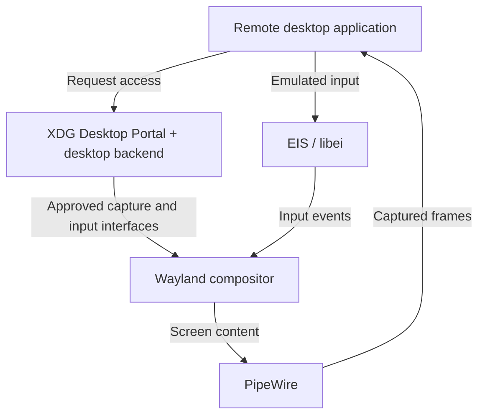

I started looking into this while working on [Termland](https://github.com/jboero/termland), a remote desktop project that creates headless Wayland sessions. What seemed like a question about connecting a client to a server turned into a much larger question: who actually owns the desktop that I am trying to access?

On Linux, the answer affects almost everything. Can I connect before logging in? Will the connection survive a locked screen? Can I create a separate desktop without a monitor? Why does a tool work on GNOME but behave differently on KDE, even when both use Wayland?

The transition from X11 to Wayland caused real regressions in established remote workflows. But describing the situation as “Wayland cannot do remote desktop” misses what has changed. Remote access now depends on the compositor, permission interfaces, and session infrastructure as well as the network protocol.

This article reflects documentation and project code reviewed in September 2026. It is an architectural overview, not a performance benchmark, and development announcements are identified separately from released capabilities.

## Table of contents

## What do we mean by remote desktop?

Before comparing protocols, we need to separate the workflows people expect.

| Workflow                   | What you are connecting to                                         |
| -------------------------- | ------------------------------------------------------------------ |
| Application forwarding     | A remotely running application whose windows appear locally        |
| Desktop sharing            | An existing desktop visible to both the local and remote user      |
| Remote login               | A login service that can create a graphical session                |
| Persistent virtual desktop | An independent desktop that can survive disconnects and be resumed |

A screen-sharing tool might be excellent for helping someone at their computer and still be unsuitable for a workstation that must be accessible after reboot. A virtual desktop can be useful without showing the applications already open on the physical display.

These differences are not academic. [GNOME's configuration documentation](https://github.com/GNOME/gnome-remote-desktop/blob/main/docs/configuration.md) explicitly separates remote assistance, single-user headless operation, and headless remote login. Any claim that a product “supports remote desktop” should say which workflow it supports.

## X11 made remote display part of the architecture

The X Window System uses a client-server model. The application is an X client; the X server provides the display and input services. The server can be on the computer in front of you while the application runs somewhere else. The [X11 protocol specification](https://xorg.freedesktop.org/archive/current/doc/xproto/x11protocol.pdf) defines that communication.

This is the foundation behind SSH X forwarding. The remote application connects to a proxy display, and SSH carries its X11 traffic to your local X server. It does not simply stream a video of the remote machine's entire desktop.

Other remote tools built different experiences around X. [Xpra](https://github.com/Xpra-org/xpra/blob/master/README.md), for example, provides persistent remote X11 applications that can be disconnected and reattached. [xrdp](https://github.com/neutrinolabs/xrdp) speaks RDP to the remote client while commonly providing the Linux desktop through Xorg with xorgxrdp, or through Xvnc.

So even in the X11 world, application forwarding, virtual desktops, and screen sharing were separate approaches. What they benefited from was a broadly available display-server integration point.

Input automation also had an established interface: the [XTEST extension](https://www.x.org/releases/X11R7.5/doc/man/man3/XTestFakeKeyEvent.3.html) can synthesize keyboard and pointer events. This helped tools interact with desktops without integrating separately with every window manager.

That convenience came with security considerations. X11 does have mechanisms for restricting untrusted clients, including the [SECURITY extension](https://www.x.org/releases/X11R7.7-RC1/doc/xextproto/security.pdf). It would be inaccurate to say it has no security model. The relevant question is how much authority a connected application receives over the rest of the desktop.

## Wayland changes the integration point

Under Wayland, the compositor is also the display server. It assembles application surfaces, manages their placement, determines focus, and routes input. Applications render their content and submit buffers for presentation. [Wayland's architecture documentation](https://wayland.freedesktop.org/architecture.html) describes this consolidation.

Mutter in GNOME, KWin in Plasma, and compositors built with wlroots are therefore central to remote access. A remote desktop server needs a way to obtain their output and send authorized input back into their sessions.

Wayland does not include X11-style network transparency in its core protocol. That does not prohibit remoting. The [upstream FAQ](https://wayland.freedesktop.org/faq.html) explicitly discusses additional remote rendering infrastructure.

This shift explains why old assumptions stop working. An application that knew how to capture an X display cannot assume the same approach will capture a complete native Wayland desktop.

[Xwayland](https://wayland.freedesktop.org/docs/book/Xwayland.html) preserves compatibility for X11 applications within a Wayland session. It does not turn the whole desktop back into an X server accessible to every legacy capture tool.

## Getting pixels is only one part of the problem

A functioning remote desktop needs capture, input, clipboard integration, authentication, and a defined session lifecycle. It also needs to handle monitor layouts, scaling, cursor behavior, and keyboard differences.

The shared infrastructure increasingly looks like this:

This is one important integration path, not a requirement that every server must use exactly this arrangement.

The [ScreenCast portal](https://flatpak.github.io/xdg-desktop-portal/docs/doc-org.freedesktop.portal.ScreenCast.html) exposes selected screen content through PipeWire. The [RemoteDesktop portal](https://flatpak.github.io/xdg-desktop-portal/docs/doc-org.freedesktop.portal.RemoteDesktop.html) handles access to input devices and related capabilities. [libei](https://libinput.pages.freedesktop.org/libei/api/index.html) supplies an emulated-input interface while leaving the compositor in control of processing events.

An important consequence is that screen sharing and remote control are separate capabilities. The [xdg-desktop-portal-wlr registration](https://raw.githubusercontent.com/emersion/xdg-desktop-portal-wlr/master/wlr.portal) advertises Screenshot and ScreenCast, but not RemoteDesktop. Being able to share a screen in a browser therefore does not prove that a remote control application can inject input through the same backend.

Permission persistence is another source of confusion. Remembering a portal grant can reduce repeated approval prompts. It does not by itself create a graphical session after reboot or preserve applications after logout.

## Why remote login is harder than screen sharing

If someone is already logged in, a compositor and graphical session already exist. A remote login service must arrange for them to exist and connect the incoming user to the correct session.

[SUSE's engineering account](https://www.suse.com/c/headless-remote-sessions-in-gnome-part-2/) describes GNOME's approach: a system daemon receives the connection, GDM creates a headless login session, and a session daemon takes over the connection. After authentication, the user session has another compositor and requires another handover. [The follow-up](https://www.suse.com/c/headless-remote-sessions-in-gnome-part-3/) explains that transition.

This is why adding a video encoder is not enough. The implementation must coordinate the display manager, credentials, session ownership, and connection transitions. RDP's server-redirection mechanism is useful here because the connection needs to move between components.

Unattended access and multi-user access also deserve separate labels. Connecting without local approval does not necessarily mean a service can provide independent desktops to several users concurrently.

## Why the experience differs across distributions

It is tempting to ask why every distribution needs its own remote desktop application. Often, the actual difference starts with the desktop environment.

[GNOME Remote Desktop](https://github.com/GNOME/gnome-remote-desktop/blob/main/README.md) integrates with Mutter. KDE provides [KRDP](https://github.com/KDE/krdp), with remote desktop configuration introduced in [Plasma 6.1](https://kde.org/announcements/plasma/6/6.1.0/). These are upstream desktop projects, rather than separate protocols invented by each distribution.

Distributions then ship particular versions, dependencies, services, and defaults. My reading of the evidence is that these combinations explain much of what users perceive as distribution-specific behavior. Both [RHEL 10](https://docs.redhat.com/en/documentation/red_hat_enterprise_linux/10/html/administering_rhel_by_using_the_gnome_desktop_environment/remotely-accessing-the-desktop) and [SLES 16](https://documentation.suse.com/sles/16.0/html/SLES-gnome-remote-desktop/index.html) document GNOME-based remote access.

Raspberry Pi Connect is a useful example of a product built around existing pieces. Its [launch announcement](https://www.raspberrypi.com/news/raspberry-pi-connect/) describes connecting a browser client to a VNC server using WebRTC. It adds the discovery and connection experience users need.

Its [documentation](https://www.raspberrypi.com/documentation/services/connect.html) also makes the integration boundary explicit: screen sharing requires an existing graphical session and a desktop supported by its WayVNC integration. Switching to KDE/KWin changes compatibility, even on the same device and distribution.

## The network protocol still matters

The compositor problem does not make protocol choice irrelevant. It means protocol choice is only one layer of the decision.

| Protocol or approach | What it provides                           | What to check separately                                |
| -------------------- | ------------------------------------------ | ------------------------------------------------------- |
| X11 forwarding       | Remote application display                 | Application compatibility and behavior over the network |
| RFB/VNC              | Framebuffer updates and input              | Supported encodings, authentication, and extensions     |
| RDP                  | Display, input, and extensible channels    | Implemented graphics, redirection, and client features  |
| Waypipe              | Wayland application forwarding             | Application and buffer compatibility                    |
| Termland             | Its own media, input, and session protocol | Client support and compositor/session integration       |

[RFB](https://www.rfc-editor.org/info/rfc6143/) is the protocol behind VNC. [RDP](https://learn.microsoft.com/en-us/windows/win32/termserv/remote-desktop-protocol) includes multiple channels and capabilities, but the label alone does not guarantee that every server implements every feature.

Also, native Wayland application forwarding exists. [waypipe](https://manpages.debian.org/bookworm/waypipe/waypipe.1.en.html) proxies Wayland applications and offers an SSH-oriented workflow resembling X forwarding. Losing built-in network transparency did not eliminate this use case; it moved the work into another component.

## What Termland does differently

Termland approaches the problem by creating a compositor environment for remote sessions. Its [labwc backend](https://github.com/jboero/termland/blob/main/crates/termland-compositor/src/backend/labwc.rs) hosts desktop-mode sessions, while its [cage backend](https://github.com/jboero/termland/blob/main/crates/termland-compositor/src/backend/cage.rs) hosts a single application.

Rather than depending on access to an arbitrary existing desktop, the server launches the environment it expects. It captures frames through screencopy and injects input through virtual keyboard and pointer protocols. Its [wire protocol](https://github.com/jboero/termland/blob/main/docs/protocol.md) carries media, input, clipboard data, and session control.

The [session implementation](https://github.com/jboero/termland/blob/main/crates/termland-compositor/src/session.rs) separates a client attachment from the detached compositor process. That is the foundation for a desktop that survives a client disconnect.

This choice also exposes a limitation worth discussing. Termland's [window-enumeration code](https://github.com/jboero/termland/blob/main/crates/termland-compositor/src/toplevels.rs) documents that Plasma's task manager expects a KWin-specific interface unavailable in labwc. Running Plasma components inside another compositor does not reproduce every part of a normal Plasma session.

Termland is therefore a useful case study in controlling the server environment, rather than evidence that compositor differences have disappeared. It owns more of the session stack and must account for the desktop integration that comes with that responsibility.

## Progress is real, but version numbers matter

The situation is not frozen. [WayVNC](https://github.com/any1/wayvnc) supports compatible wlroots-based sessions, including headless ones. [Weston](https://wayland.pages.freedesktop.org/weston/toc/running-weston.html) provides an RDP backend. GNOME has remote login infrastructure.

KDE's [August 2026 development report](https://planet.kde.org/david-edmundson-2026-08-25-whats-happening-in-kde-remote-desktop-improved-unattended-mode-and-more/) describes work toward Plasma 6.8 on unattended operation, input, clipboard behavior, and compatibility. It also identifies concurrent multi-user headless service as unfinished. These are development milestones, not guarantees about every distribution's installed packages.

RustDesk likewise announced an [unattended Wayland preview](https://rustdesk.com/blog/unattended-remote-access-wayland/) for x86_64 Debian/Ubuntu systems in August 2026. The preview qualification matters when comparing available products.

Performance needs similar care. A codec's compression efficiency or a transport's features do not establish end-to-end responsiveness. Capture, encoding, queues, network loss, decoding, and presentation all contribute. A still desktop's bandwidth says little about typing latency or scrolling quality.

## What I want from Linux remote desktop

I want compatibility claims to describe actual workflows: an existing desktop, a new session, access after reboot, disconnect and resume, and multiple users. I also want them to identify the tested compositor and version.

The architecture already offers several ways forward: integrate with the desktop compositor, use shared portal infrastructure, or create a dedicated remote compositor. Each has useful capabilities and practical costs.

Working through Termland made the missing piece clearer to me. Linux needs more reusable infrastructure around session creation and ownership, alongside capture and input standards. Users should be able to choose a remote desktop tool with a clear understanding of what it can access and how long that session will live.

Wayland remoting is possible and improving. Making it predictable across desktops is the work still in front of us.
